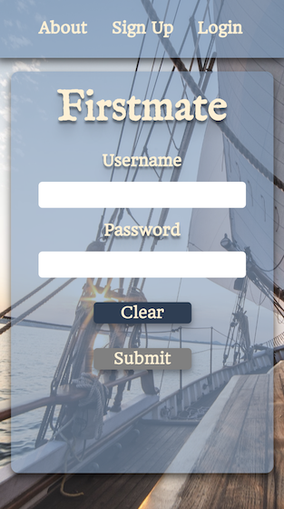
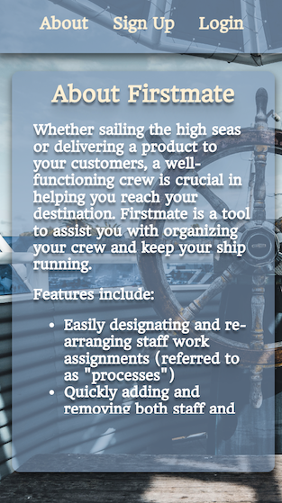

# About Firstmate

Whether sailing the high seas or delivering a product to your customers, a well-functioning crew is crucial in helping you reach your destination. Firstmate is a tool to assist you with organizing your crew and keep your ship running.

Features include:

-Easily designating and re-arranging staff work assignments (referred to as "processes")
-Quickly adding and removing both staff and processes
-Staff has the ability to login and see the changes you have made to work assignments

## Live Demo
https://firstmate-app.herokuapp.com/

Create your own login or use the demo login:
>Username: demo
>Password: demopassword

## Screenshots

### Landing Page 

#### Login Mobile

#### Login Desktop

#### About Mobile

#### About Desktop

#### Sign-up Mobile

#### Sign-up Desktop

### Assignment Board

#### Full Board - Mobile

#### Full Board - Desktop

#### Modal Example - Mobile

#### Modal Example - Desktop

## Future Features
* Administrative vs View Only Users

  * View only can subscribe to a board but not modify it

  * Admins will have full control of a board as well as other users

* Close/Open status

* Exportable Reporting

* Summary Table

## Built With
* HTML

* CSS

* Javascript

* JQuery

* Bootstrap

* FooTable

* Node.js/Express

* Mongoose

### Live Environment
* Heroku

* MLab

* Travis-ci

### Testing
* Mocha

* Chai

## Author
Shannon Canedy

## Acknowledgments
Mentor: Wojciech Kwiatek
